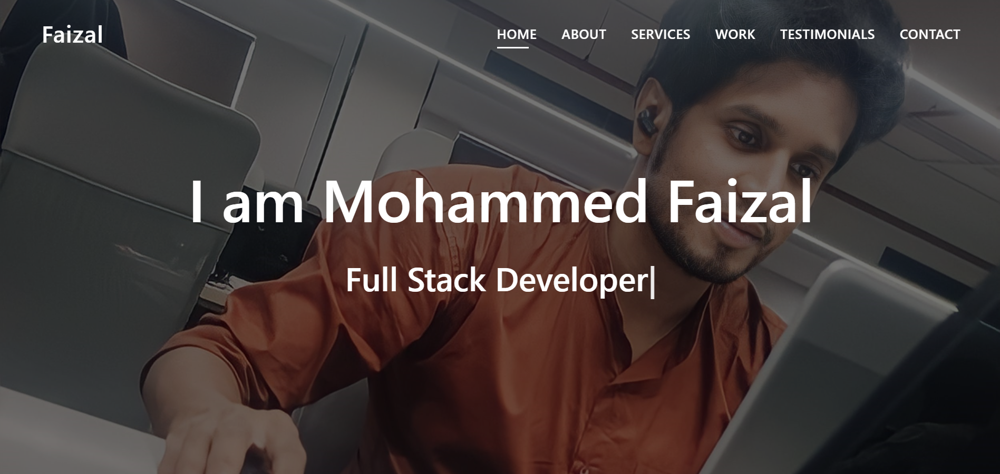

<div align="center">

# 👨‍💻 FAIZAL'S PERSONAL PORTFOLIO
### *Showcasing the Journey from Web Design to Full-Stack Engineering*

[](https://developer.mozilla.org/en-US/docs/Web/JavaScript)
[](https://developer.mozilla.org/en-US/docs/Web/HTML)
[](https://developer.mozilla.org/en-US/docs/Web/CSS)

**A professional landing page designed to present my technical skills, academic background, and web development projects.**
</div>

---

## 📖 Overview
This portfolio serves as a central hub for my professional identity. Built using **Vanilla JavaScript**, it demonstrates my ability to handle DOM manipulation and create interactive user experiences without relying on heavy frameworks. It highlights my transition from an Electrical Engineering background into specialized Software Development.

---

## 📸 Preview
<div align="center">
  
</div>

*Note: Since this is a static project, buttons and links are for visual representation only.*

---

## ✨ Key Features
* **🖱️ Interactive Navigation:** Smooth scrolling and active-link highlighting using JavaScript.
* **📱 Responsive Design:** A mobile-first approach ensuring compatibility across all screen sizes.
* **📁 Project Gallery:** A curated display of my early work, including clones and landing pages.
* **📩 Contact Integration:** A clean contact section for professional networking and inquiries.

---

## 💻 Tech Stack
| Component | Technology |
| :--- | :--- |
| **Logic/Interactivity** | Vanilla JavaScript (ES6+) |
| **Structure** | Semantic HTML5 |
| **Styling** | Custom CSS3 (Flexbox & Grid) |
| **Assets** | FontAwesome Icons & Optimized Web Imagery |

---

## 🏗️ Architecture
The project follows a modular frontend structure:
- `index.html`: The core structural blueprint.
- `style.css`: Centralized styling for consistent branding.
- `main.js`: Logic for scroll reveals, mobile menu toggling, and UI animations.


---

## 🚦 Getting Started
1. **Clone the repository:**
   ```bash
   git clone [https://github.com/faizal08/FAIZAL-PORTFOLIO.git](https://github.com/faizal08/FAIZAL-PORTFOLIO.git)

2. Open `index.html` in any modern web browser.

---

## 📧 Contact
- **Developer:** [Faizal](https://github.com/faizal08)
- **Email:** [reachfaizal08@gmail.com](mailto:reachfaizal08@gmail.com)
   
